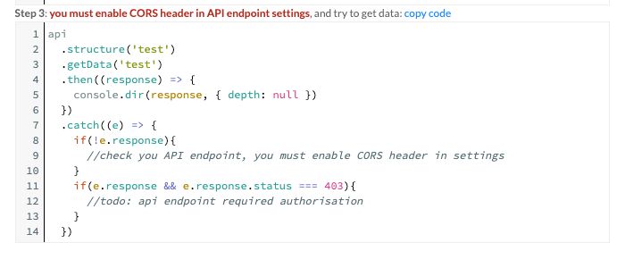

This project was bootstrapped with [Create React App](https://github.com/facebook/create-react-app).

# How create simple portal with directual-api


## Step 1: create a react bootstrap project and bind required dependencies

`npm install -g create-react-app`

go to home directory and run command:

`npm init react-app directual-api-example`

go to the your new project folder:

`cd directual-api-example`

and install necessary libs: react-router-dom, directual-api:

`npm install react-router-dom --save `

`npm install directual-api --save `

`npm install http-proxy-middleware --save `


## Step 2: create middleware proxy to directual.api, for resolve problem linked with CORS

create `src/setupProxy.js` file in you src directory, and insert this text

```javascript
const { createProxyMiddleware } = require('http-proxy-middleware');
 module.exports = function(app) {
   app.use(
     '/good/api',
     createProxyMiddleware({
       target: 'https://api.alfa.directual.com',
       changeOrigin: true,
     })
   );
 };
```


## Step 3: Run you app: 

The command: `npm run start` runs the app in the development mode.<br />
Open [http://localhost:3000](http://localhost:3000) to view it in the browser.

The page will reload if you make edits.<br />
You will also see any lint errors in the console.


....

## Step 4: embed a simple structure
create `pages` folder and insert 3 files

`src/pages/DashboardPage.js`
```javascript
import React from 'react'

export default function DashBoardPage () {
  return (
    <div>
      <h2>Home</h2>
    </div>
  )
}
```
`src/pages/HomePage.js`
```javascript
import React from 'react'

export default function DashBoardPage () {
  return (
    <div>
      <h2>Home</h2>
    </div>
  )
}
```

`src/pages/LoginPage.js`
```javascript
import { useHistory, useLocation } from 'react-router-dom'
import React, {useState} from 'react'
import { ProvideAuth, useAuth } from "./../auth";

export function ProfileBlock () {
  let history = useHistory()
  const auth = useAuth();
  return auth.user ? (
    <p>
      Welcome, {auth.user}!
      <button
        onClick={() => {
          auth.signout(() => history.push('/'))
        }}
      >
        Sign out
      </button>
    </p>
  ) : (
    <p>You are not logged in.</p>
  )
}

export default function LoginPage ({ authModule }) {
  let history = useHistory()
  let location = useLocation()

  const [username, setUsername] = useState('');
  const [password, setPassword] = useState('');
  const [error, setError] = useState('');

  let { from } = location.state || { from: { pathname: '/' } }
  const auth = useAuth();

  let login = () => {
    auth.login(username, password).then(()=>{
      history.replace(from);
    }).catch(e=>{
      setError("You login or password incorrect")
    })
  }

  return (
    <div>
      <p>You must log in to view the page at {from.pathname}</p>
      <input onChange={(e)=> {
        setUsername(e.target.value)
      }}/>
      <input onChange={(e)=> {
        setPassword(e.target.value)
      }}/>
      {error}
      <button onClick={login}>Log in</button>
    </div>
  )
}
```


create `src/pages/auth.js` file and 
```diff
! REPLACE APP_ID
```

`src/pages/auth.js`

```javascript
import React, { useState, useEffect, useContext, createContext } from "react";
import Directual from 'directual-api';
const config = {
  appID: '__APP_ID__',
  apiHost: '/',
}
const api = new Directual(config);

const authContext = createContext();

export function ProvideAuth({ children }) {
  const auth = useProvideAuth();
  return <authContext.Provider value={auth}>{children}</authContext.Provider>;
}

export const useAuth = () => {
  return useContext(authContext);
};

// Provider hook that creates auth object and handles state
function useProvideAuth() {
  const [user, setUser] = useState(null);
  const [sessionID, setSessionID] = useState(null);

  const login = (username, password) => {
    return api.auth.login(username, password).then(res=>{
      setUser(res.username)
      setSessionID(res.sessionID)
    })
  };

  const signout = (cb) => {
    return api.auth.logout('').then(res=>{
      setUser(null)
      setSessionID(null)
      cb()
    })
  };

  useEffect(() => {
    api.auth.isAuthorize((status, token)=>{
      if(status === true){
        setUser(token.username)
        setSessionID(token.sessionID)
      }
    })
  }, []);

  return {
    user,
    sessionID,
    login,
    signout
  };
}
```


change you `src/App.js`

`src/App.js`

```javascript
import React, { useState, useEffect } from 'react';
import {
  BrowserRouter as Router,
  Switch,
  Route,
  Link,
  Redirect,
  useHistory,
  useLocation
} from 'react-router-dom'
import './App.css'
import LoginPage, { ProfileBlock } from './pages/LoginPage'
import HomePage from './pages/HomePage'
import DashboardPage from './pages/DashboardPage'
import { ProvideAuth, useAuth } from "./auth";


function PrivateRoute ({ children, ...rest }) {
  const auth = useAuth();
  return (
    <Route
      {...rest}
      render={({ location }) =>
        auth.user ? (
          children
        ) : (
          <Redirect
            to={{
              pathname: '/login',
              state: { from: location }
            }}
          />
        )
      }
    />
  )
}

function App () {
  useEffect( ()=>{

  })
  return ( <ProvideAuth>
    <Router>
      <div>
        <ul>
          <li>
            <Link to="/">Home</Link>
          </li>
          <li>
            <Link to="/dashboard">Dashboard</Link>
          </li>
        </ul>

        <ProfileBlock />

        <hr/>

        <Switch>
          <Route path="/login">
            <LoginPage />
          </Route>
          <Route exact path="/">
            <HomePage />
          </Route>
          <PrivateRoute path="/dashboard">
            <DashboardPage />
          </PrivateRoute>
        </Switch>
      </div>
    </Router>
    </ProvideAuth>
  )
}

export default App

```

# Try use directual api

Open ApiEndpoints section on [Directual](https://my.directual.com), 
choose any endpoint
and press 

`Endpoint respond preview`


after copy code in section `How it use? step 3` to useEffect function.




Example result page: `src/pages/DashboardPage.js`

```javascript
import React, { useEffect, useState } from 'react'
import Directual from 'directual-api';
import { useAuth } from '../auth'
const config = {
  appID: '050e77bb-b0e6-4685-8712-a85774fad272',
  apiHost: '/',
}
const api = new Directual(config);

export default function DashBoardPage () {
  const [payload, setPayload] = useState([]);
  const [loading, setLoading] = useState(true);
  const auth = useAuth();

  useEffect( ()=>{
    api
      .structure('test')
      .getData('test', {sessionID:auth.sessionID})
      .then((response) => {
        setPayload(response.payload)
        setLoading(false)
      })
      .catch((e) => {
        setLoading(false)
        if(!e.response){
          //check you API endpoint, you must enable CORS header in settings
        }
        if(e.response && e.response.status === 403){
          //todo: api endpoint required authorisation
        }
      })
  })
  return (
    <div>
      <h2>Dashboard</h2>
      {loading && <span>loading</span>}
      {payload.map((data)=>{
        return <div>{JSON.stringify(data)}</div>
      })}
    </div>
  )
}
```


